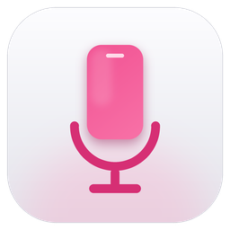
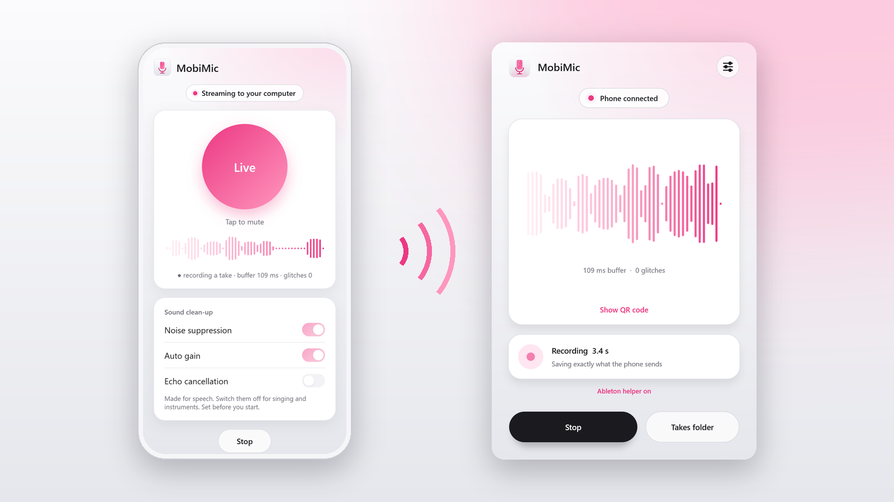
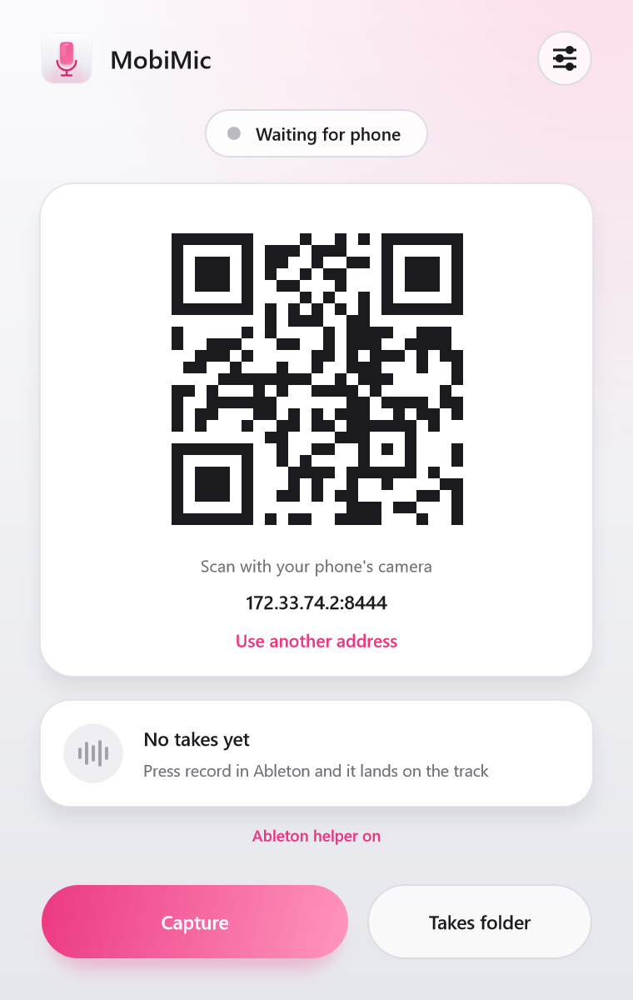
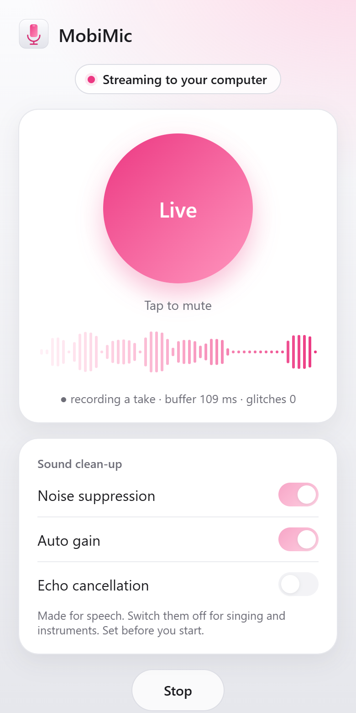
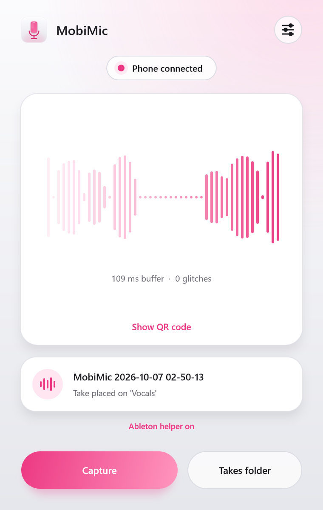
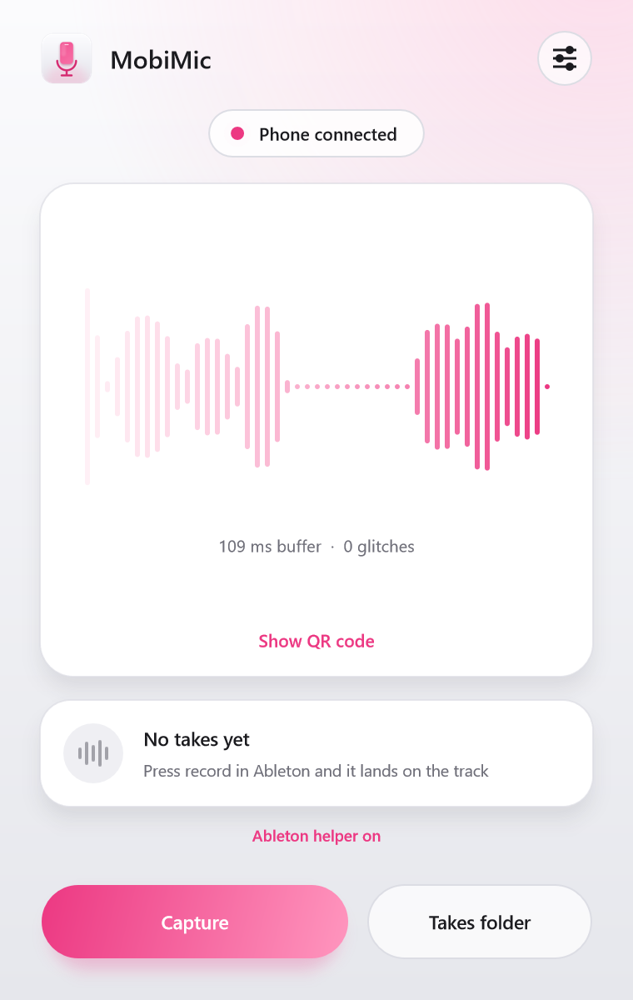
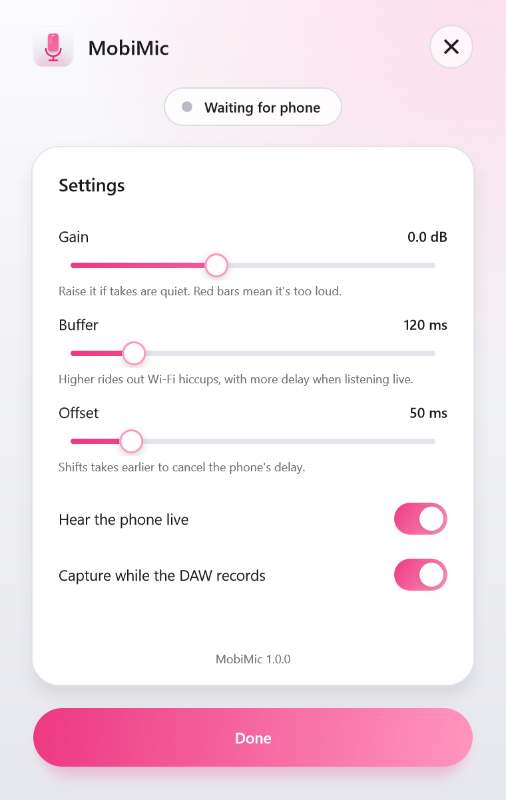
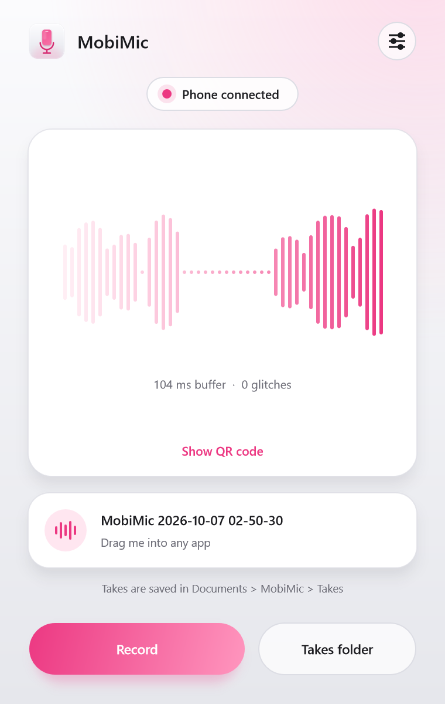

<p align="center">
  
</p>

<h1 align="center">MobiMic</h1>

<p align="center">
  <b>Your phone is the microphone.</b><br>
  A free, open-source VST3 plugin and app for Windows. Scan a QR code and record your phone's mic straight into your DAW.
</p>

<p align="center">
  <a href="https://aryanjsawant.github.io/MobiMic/"><b>Website</b></a> &nbsp;·&nbsp;
  <a href="../../releases/latest"><b>Download</b></a> &nbsp;·&nbsp;
  <a href="https://aryanjsawant.github.io/MobiMic/#guide"><b>Guide</b></a> &nbsp;·&nbsp;
  <a href="https://aryanjsawant.github.io/MobiMic/#faq"><b>FAQ</b></a>
</p>

<p align="center">
  
  
  
  
</p>

<p align="center">
  
</p>

## Why MobiMic

- **Nothing to install on the phone.** It runs in the phone's browser.
- **No audio driver, no virtual cable.** The audio arrives inside the plugin.
- **Press record, like any mic.** In Ableton Live the take lands on the track as a clip, right where you started recording.
- **Takes without gaps.** Each take is saved exactly as the phone sent it, so a Wi-Fi hiccup can't ruin it.
- **Wi-Fi, hotspot or USB tethering.** Whatever connects your phone and computer.
- **Private.** Audio goes straight from phone to computer on your local network, encrypted. No account, no cloud.

## How it works

<table>
  <tr>
    <td width="33%" align="center"></td>
    <td width="33%" align="center"></td>
    <td width="33%" align="center"></td>
  </tr>
  <tr>
    <td align="center"><b>1.</b> Add MobiMic to a track</td>
    <td align="center"><b>2.</b> Scan the QR code and tap <b>Start</b></td>
    <td align="center"><b>3.</b> Press record. The take lands on the track</td>
  </tr>
</table>

## Install

1. Download `MobiMic-Setup-x.y.z.exe` from the [Releases](../../releases/latest) page and run it.
   Windows may show "Windows protected your PC" because the installer isn't code-signed yet: click **More info → Run anyway**.
2. Open your DAW and rescan plug-ins if MobiMic doesn't show up.
3. **Ableton Live only:** restart Live, open **Preferences → Link, Tempo & MIDI**, and choose **MobiMic** in a free **Control Surface** slot (leave Input and Output on None). This turns on the helper that places your takes on the track.

The installer adds the VST3 plugin, the standalone app (Start menu → MobiMic), the Ableton Live helper, and a Windows Firewall rule so your phone can reach it.

## Use

1. Put the phone and the computer on the same network: the same Wi-Fi, the phone's hotspot, or USB tethering.
2. Drag **MobiMic** onto an audio track, or open the app.
3. Scan the QR code with the phone's camera.
4. The first time, the browser warns that the connection is not private. [This is expected](https://aryanjsawant.github.io/MobiMic/#warning): tap **Advanced → Proceed**, allow the microphone, and tap **Start**.
5. Record:
   - **Ableton Live:** press record in the Arrangement. When you stop, the take is on the MobiMic track.
   - **Other DAWs:** record as usual, then drag the take from the plugin window onto a track.
   - **Standalone app:** press **Record**, then drag the take into any app.

Keep the phone's screen on while you use it. The full guide, settings reference and troubleshooting are on the [website](https://aryanjsawant.github.io/MobiMic/#guide).

## The plugin and the app

<table>
  <tr>
    <td align="center"></td>
    <td align="center"></td>
    <td align="center"></td>
  </tr>
  <tr>
    <td align="center"><b>Plugin</b><br>live waveform from the phone</td>
    <td align="center"><b>Settings</b><br>gain, buffer, offset and monitoring</td>
    <td align="center"><b>Standalone app</b><br>record without a DAW</td>
  </tr>
</table>

| Setting | What it does |
| --- | --- |
| **Gain** | Volume of the phone signal, for what you hear and what is recorded. Applied on the phone, so boosting adds no noise. A red waveform means too loud. |
| **Buffer** | How much audio is held back to ride out network hiccups. Higher means fewer dropouts and more delay when listening live. |
| **Offset** | How far each take is shifted earlier to cancel the phone's delay (plugin only). |
| **Hear the phone live** | Plays the phone through the track or your speakers. Takes are recorded either way. |
| **Capture while the DAW records** | Saves a take automatically whenever the DAW is recording (plugin only). |

## Good to know

- **Live audio can drop out; takes don't.** A network stall longer than the buffer is audible live. The saved take is written from the complete stream, so it has every sample in order. A connection that drops entirely and reconnects does leave a gap.
- **Not for monitoring your own voice.** What you hear live is roughly a tenth of a second behind. Listen to the backing track and add effects to the take afterwards.
- **Phones.** Chrome on Android is the tested setup. iPhone (Safari) is untested and may refuse the connection.
- **Ableton helper.** Placing takes on the timeline works in Live 12's Arrangement view. Session view slots are not filled.
- **One phone at a time**, received by one MobiMic instance per project.

## Build from source

Requirements: Windows 10 or 11, Visual Studio 2022 with the "Desktop development with C++" workload, Git, Python 3 with `numpy` and `websockets`, Chrome or Edge (for one test), and optionally [Inno Setup 6](https://jrsoftware.org/isdl.php) for the installer.

```bat
build.bat
```

This fetches JUCE, Mbed TLS and the QR code library, builds the plugin and the app, runs the tests, and writes the installer to `installer\Output`. Pushing a tag such as `v1.0.0` makes GitHub Actions do the same and attach the installer to a release.

### Under the hood

```
phone browser ──HTTPS + secure WebSocket over the local network──▶ MobiMic ──▶ track / speakers
                                                                      │
                                                                      └──▶ gap-free take (.wav) ──▶ Ableton helper ──▶ clip on the timeline
```

MobiMic contains a small HTTPS and WebSocket server. The phone opens a page from it, captures the microphone, and streams 48 kHz mono audio back. A lock-free buffer absorbs network jitter and continuously corrects for the two devices' clocks running at slightly different speeds, then resamples to the DAW's sample rate.

| Path | Purpose |
| --- | --- |
| [`plugin/src/`](plugin/src) | The plugin and app: server ([`PhoneServer`](plugin/src/PhoneServer.cpp)), jitter buffer ([`DriftBuffer`](plugin/src/DriftBuffer.h)), take capture ([`TakeWriter`](plugin/src/TakeWriter.cpp)), window ([`PluginEditor`](plugin/src/PluginEditor.cpp), [`Theme`](plugin/src/Theme.h)). |
| [`plugin/web/`](plugin/web/index.html) | The page the phone opens. |
| [`ableton/MobiMic/`](ableton/MobiMic/__init__.py) | The Ableton Live helper: tells the plugin when recording starts and stops, then places the take. |
| [`plugin/tests/`](plugin/tests) | Tests: a fake phone streams through the real server under clock drift and network stalls; a fake host presses record; the phone page runs in headless Chrome; the helper runs against a fake Live. |
| [`plugin/tools/`](plugin/tools) | Regenerates the icon and every image in this README from the real product. |
| [`docs/`](docs) | The website (GitHub Pages) and images. |
| [`installer/`](installer/setup.iss) | Inno Setup script. |
| [`prototype/`](prototype) | The original Python proof of concept, which feeds a virtual audio cable instead. |

See [CONTRIBUTING.md](CONTRIBUTING.md) to get involved and [CHANGELOG.md](CHANGELOG.md) for what changed.

## License

MobiMic is licensed under the [GNU Affero General Public License v3.0](LICENSE).

It uses [JUCE](https://juce.com) (AGPLv3), [Mbed TLS](https://github.com/Mbed-TLS/mbedtls) (Apache-2.0) and [QR Code generator](https://github.com/nayuki/QR-Code-generator) by Project Nayuki (MIT). VST is a registered trademark of Steinberg Media Technologies GmbH. Ableton and Live are trademarks of Ableton AG. MobiMic is not affiliated with either.
