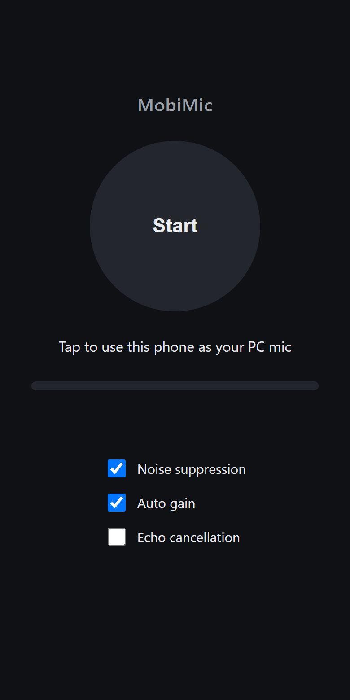

<h1 align="center">MobiMic</h1>

<p align="center">
  <b>Your phone is a wireless microphone for your DAW.</b><br>
  A free, open-source VST3 plugin for Windows. Add it to a track, scan a QR code, record.
</p>

<p align="center">
  
  
  
  
</p>

<p align="center">
  
</p>

- **Nothing to install on the phone.** It runs in the phone's browser.
- **No audio driver, no virtual cable.** The audio arrives inside the plugin.
- **No account and no internet needed.** Audio goes straight from phone to computer over your local network, encrypted.
- **Works over Wi-Fi, a phone hotspot, or USB tethering.**
- **Gap-free takes.** Every recording is also saved exactly as the phone sent it, so a Wi-Fi hiccup can't ruin a take.

## Contents

- [Install](#install)
- [Use](#use)
- [Recording](#recording)
- [Controls](#controls)
- [Things to know](#things-to-know)
- [Troubleshooting](#troubleshooting)
- [Build from source](#build-from-source)
- [How it works](#how-it-works)
- [License](#license)

## Install

1. Download `MobiMic-Setup-x.y.z.exe` from the [Releases](../../releases) page and run it.
   Windows may show "Windows protected your PC" because the installer isn't code-signed yet: click **More info → Run anyway**.
2. Open your DAW and rescan plug-ins if MobiMic doesn't show up.
   In Ableton Live: **Preferences → Plug-Ins**, turn on **Use VST3 Plug-In System Folders**, then **Rescan**.

The installer puts the plugin in `C:\Program Files\Common Files\VST3` and allows its ports through Windows Firewall so the phone can reach it.

## Use

<table>
  <tr>
    <td width="33%" align="center"></td>
    <td width="33%" align="center"></td>
    <td width="33%" align="center"></td>
  </tr>
  <tr>
    <td align="center"><b>1.</b> Add MobiMic to an audio track</td>
    <td align="center"><b>2.</b> Scan the QR code and tap <b>Start</b></td>
    <td align="center"><b>3.</b> The phone plays through the track</td>
  </tr>
</table>

1. Drag **MobiMic** onto an audio track.
2. Put the phone and the computer on the same network: the same Wi-Fi, or connect the computer to the phone's hotspot or USB tethering.
3. Scan the QR code in the plugin window with the phone's camera.
4. The first time, the browser warns that the connection is not private. [This is expected](#things-to-know): tap **Advanced → Proceed**, allow microphone access, and tap **Start**.

Keep the phone's screen on while you use it. Tap the big button on the phone to mute and unmute.

## Recording

There are two ways to record the phone.

### Captured takes (recommended)


While your DAW is recording, MobiMic saves exactly what the phone sent to a WAV file in `Documents\MobiMic\Takes`. When you stop, the take appears in the plugin window: **drag it onto a track**.

You can also start and stop a take by hand with the **Capture** button.

A captured take contains every sample the phone sent, in order, even if the live sound dropped out because of Wi-Fi. It starts when capture starts and doesn't include the live buffer delay, so nudge it into place against your other tracks.

### Live

A track records its input, not the output of the plugins on it. To record the live signal in Ableton Live, create a second audio track, set **Audio From** to the MobiMic track with **Post FX**, and arm that track.

<br clear="right">

## Controls

| Control | What it does |
| --- | --- |
| **Buffer** | How much audio is held back to ride out network hiccups. Higher means more delay and fewer dropouts. 120 ms suits most networks; use 300 ms on a shaky one. |
| **Gain** | Volume of the phone signal. |
| **Capture while the DAW records** | Saves a take automatically whenever the DAW is recording. |
| **Capture** | Starts and stops a take by hand. |
| **Other address** | Shown when the computer has several network addresses. If the page doesn't load on the phone, click it and scan again. |

On the phone you can switch **noise suppression**, **auto gain** and **echo cancellation** on or off before tapping Start. Turn all three off for instruments and singing; leave the first two on for speech.

## Things to know

- **The browser warning.** Phone browsers only allow microphone access on encrypted (HTTPS) pages. MobiMic creates its own certificate on your computer for this, and since no authority has vouched for it, the browser asks you to confirm once per address. The audio is encrypted and never leaves your local network.
- **Live audio can drop out.** Wireless audio can't be guaranteed gap-free in real time. MobiMic corrects for the phone and computer clocks drifting apart and buffers against network stalls, but a stall longer than the buffer is audible. The plugin and the phone page both show a glitch counter. Captured takes are not affected.
- **Delay.** Roughly the buffer size plus about 50 ms. Fine for recording and talking; too much for monitoring yourself while singing.
- **One phone at a time**, received by one MobiMic instance per project.
- **Phones.** Chrome on Android is the tested setup. iPhone (Safari) is untested and may refuse the connection.

## Troubleshooting

<details>
<summary><b>"This site can't be reached" on the phone</b></summary>

- Check that the phone and computer are on the same network. Guest and public Wi-Fi often stop devices from talking to each other; a phone hotspot or USB tethering works.
- Click **Other address** in the plugin and scan again.
- Windows Firewall: the installer allows MobiMic's ports (TCP 8443–8452). If Windows is set to block all incoming connections on public networks, that overrides the rule. Open **Windows Security → Firewall & network protection → Public network** and untick **Blocks all incoming connections**, or mark the network as Private in **Settings → Network & internet**.
</details>

<details>
<summary><b>The plugin says "already on another track"</b></summary>

Another MobiMic instance in the same DAW has the phone. Remove it, or use that one.
</details>

<details>
<summary><b>Choppy sound</b></summary>

Raise **Buffer**, move closer to the router or phone, or use USB tethering. For anything you want to keep, use a captured take.
</details>

<details>
<summary><b>MobiMic doesn't appear in the DAW</b></summary>

Make sure the DAW scans the system VST3 folder (`C:\Program Files\Common Files\VST3`) and run a rescan.
</details>

## Build from source

Requirements: Windows 10 or 11, Visual Studio 2022 with the "Desktop development with C++" workload, Git, Python 3 with `numpy` and `websockets` (for the tests), and optionally [Inno Setup 6](https://jrsoftware.org/isdl.php) for the installer.

```bat
build.bat
```

This fetches JUCE, Mbed TLS and the QR code library, builds the plugin to `plugin\build\MobiMic_artefacts\Release\VST3\MobiMic.vst3`, runs the tests, and writes the installer to `installer\Output`.

Pushing a tag such as `v0.1.0` makes GitHub Actions build the installer and attach it to a release.

## How it works

```
phone browser ──HTTPS + secure WebSocket over the local network──▶ MobiMic plugin ──▶ track
                                                                        │
                                                                        └──▶ gap-free take (.wav)
```

The plugin contains a small HTTPS and WebSocket server. The phone opens a page from it, captures the microphone, and streams 48 kHz mono audio back. A lock-free buffer in the plugin absorbs network jitter and continuously corrects for the two devices' clocks running at slightly different speeds, then resamples to the DAW's sample rate.

| Path | Purpose |
| --- | --- |
| [`plugin/web/index.html`](plugin/web/index.html) | The page the phone opens. |
| [`plugin/src/PhoneServer.cpp`](plugin/src/PhoneServer.cpp) | HTTPS and WebSocket server (Mbed TLS) and certificate creation. |
| [`plugin/src/DriftBuffer.h`](plugin/src/DriftBuffer.h) | Jitter buffer with clock-drift correction and sample-rate conversion. |
| [`plugin/src/TakeWriter.cpp`](plugin/src/TakeWriter.cpp) | Writes the received stream to WAV for captured takes. |
| [`plugin/src/PluginProcessor.cpp`](plugin/src/PluginProcessor.cpp), [`PluginEditor.cpp`](plugin/src/PluginEditor.cpp) | The JUCE plugin and its window. |
| [`plugin/tests/`](plugin/tests) | Integration tests: a fake phone streams through the real server under clock drift and network stalls, and the captured take is compared bit for bit. |
| [`plugin/tools/`](plugin/tools) | Regenerates the images in this README from the real plugin and phone page. |
| [`installer/setup.iss`](installer/setup.iss) | Inno Setup script. |
| [`prototype/`](prototype) | The original Python proof of concept, which feeds a virtual audio cable instead of a plugin. |

## License

MobiMic is licensed under the [GNU Affero General Public License v3.0](LICENSE).

It uses [JUCE](https://juce.com) (AGPLv3), [Mbed TLS](https://github.com/Mbed-TLS/mbedtls) (Apache-2.0) and [QR Code generator](https://github.com/nayuki/QR-Code-generator) by Project Nayuki (MIT). VST is a registered trademark of Steinberg Media Technologies GmbH.
